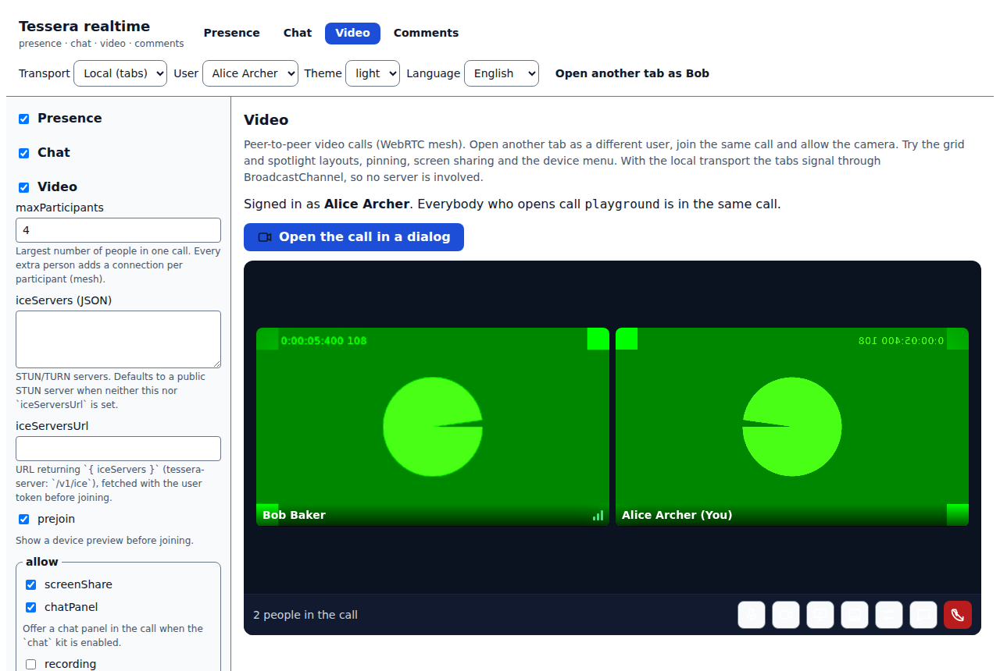
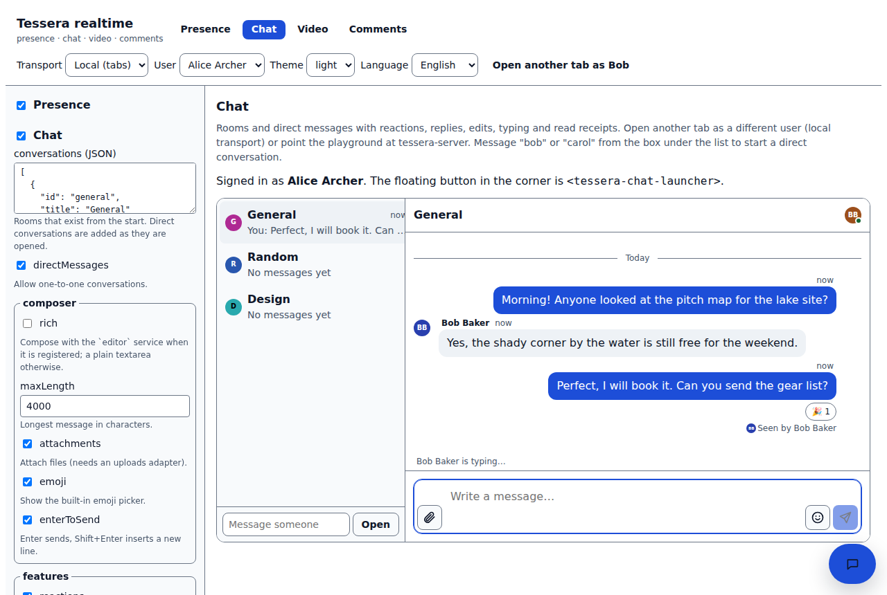
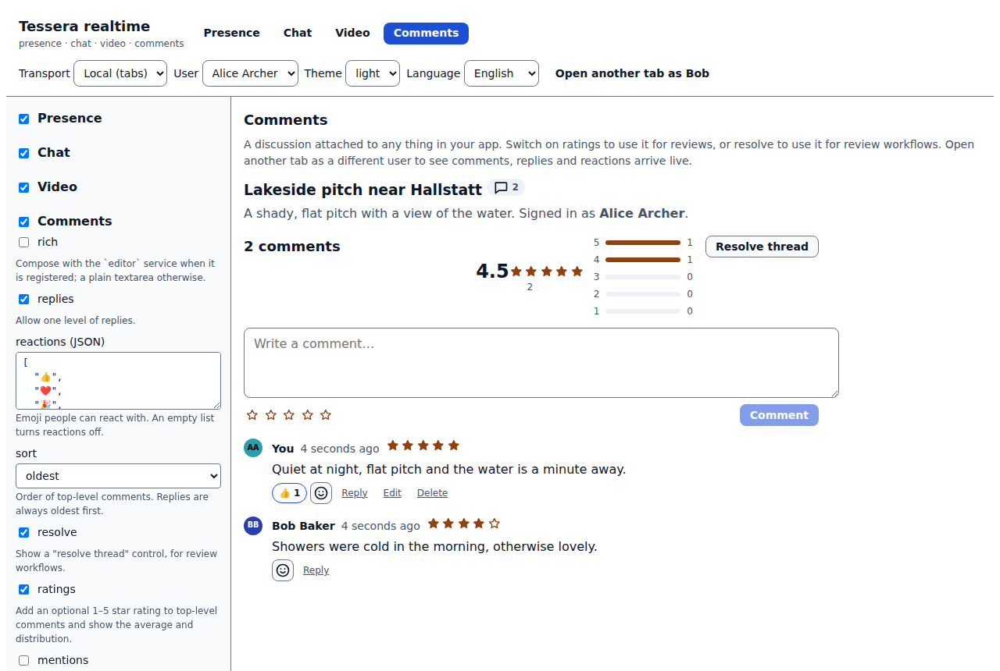
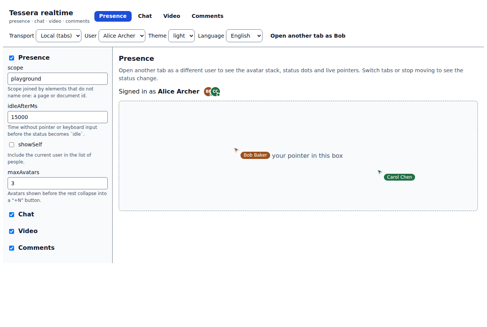

<h1 align="center">tessera-realtime</h1>

<p align="center"><b>Pluggable realtime for any web app: presence, chat, WebRTC video calls and comment threads.</b> Part of the <a href="https://github.com/thakurabhishek7283/tessera">Tessera</a> kit family: switch a feature on with configuration, use it in any framework, run it across browser tabs with no backend or against <a href="https://github.com/thakurabhishek7283/tessera-server">tessera-server</a>.</p>

<p align="center">
  <a href="https://github.com/thakurabhishek7283/tessera-realtime/actions/workflows/ci.yml"></a>
  <a href="LICENSE"></a>
  · <a href="https://thakurabhishek7283.github.io/tessera-realtime/">Live demo</a>
</p>

<p align="center"></p>

## Why

Chat, calls and comments are in almost every collaborative product, and each one tends to arrive with its own backend, its own socket handling and its own framework glue. These kits sit on the small Tessera core instead: they talk through a *transport* and a *storage* adapter, so the same code runs between two tabs of one browser (which is how the live demo works, with nothing to host), against the reference server, or against your own backend. A feature you do not enable never loads its code, and every UI piece is a web component, so it works in React, Angular, Vue or plain HTML.

## Packages

| Package | What it gives you | More |
| --- | --- | --- |
| [`@tessera-kit/presence`](packages/presence) | Who is here: `<tessera-presence>` avatar stack with status dots, `<tessera-cursors>` live pointers, idle and away detection | [README](packages/presence/README.md) |
| [`@tessera-kit/chat`](packages/chat) | `<tessera-chat>`, `<tessera-inbox>`, `<tessera-chat-launcher>`: rooms and direct messages, replies, reactions, edits, typing, read receipts, attachments, emoji, long conversations | [README](packages/chat/README.md) |
| [`@tessera-kit/video`](packages/video) | `<tessera-call>`, `<tessera-call-button>`: WebRTC mesh calls with device preview, grid and spotlight, screen sharing, device switching, active speaker, connection quality | [README](packages/video/README.md) |
| [`@tessera-kit/comments`](packages/comments) | `<tessera-comments>`, `<tessera-comment-count>`: threaded discussion on anything with an id, replies, reactions, star ratings with a summary, resolve | [README](packages/comments/README.md) |

Every package also has a headless API and a `/react` entry. The private packages `@tessera-internal/react-wrap` and `test-utils` are bundled into the kits.

<table>
  <tr>
    <td></td>
    <td></td>
    <td></td>
  </tr>
</table>

## Quick start

The packages are not on npm yet, so build them from source first (see [Development](#development)). The snippets show the code you will write once they are installed.

### Any framework (Web Components)

```html
<script type="module">
  import '@tessera-kit/chat/elements';
  import '@tessera-kit/comments/elements';
</script>

<tessera-chat conversation="support"></tessera-chat>
<tessera-comments target="listing-42"></tessera-comments>
```

A bare element runs on Tessera's implicit default instance, which uses the `local` transport (tabs of one browser talk through `BroadcastChannel`) and IndexedDB, and turns its own feature on with the defaults. Open the page in two tabs and the chat already works.

### React

```tsx
import { Chat } from '@tessera-kit/chat/react';
import { Comments } from '@tessera-kit/comments/react';
import { Call } from '@tessera-kit/video/react';

export function Support({ listingId }: { listingId: string }) {
  return (
    <>
      <Chat conversation="support" />
      <Comments target={listingId} />
      <Call callId={`support-${listingId}`} />
    </>
  );
}
```

The wrappers do nothing on the server, so they are safe in Next.js; import them with `dynamic(() => import(...), { ssr: false })` if you want to avoid the empty tag in the HTML.

### With other Tessera kits

Turn kits on and off in one place; each loads only when enabled.

```ts
import { createTessera } from '@tessera-kit/core';
import { createStorage } from '@tessera-kit/storage';
import { createTransport } from '@tessera-kit/transport';

const tessera = createTessera(
  {
    appId: 'my-app',
    auth: { type: 'static', user: { id: 'u1', name: 'Ada' }, token },
    transport: { type: 'websocket', url: 'wss://api.example.com/v1/ws' }, // or { type: 'local' }
    storage: { type: 'rest', baseUrl: 'https://api.example.com' },
    features: {
      presence: { enabled: true },
      chat: { enabled: true, conversations: [{ id: 'support', title: 'Support' }] },
      video: { enabled: true, iceServersUrl: 'https://api.example.com/v1/ice', maxParticipants: 4 },
      comments: { enabled: true, ratings: true },
    },
  },
  {
    plugins: {
      presence: () => import('@tessera-kit/presence'),
      chat: () => import('@tessera-kit/chat'),
      video: () => import('@tessera-kit/video'),
      comments: () => import('@tessera-kit/comments'),
    },
    adapters: { transport: createTransport, storage: createStorage },
  },
);
```

Kits never import each other. They find each other through the service registry: with the `presence` kit on, `<tessera-chat>` shows who is in the conversation and `<tessera-call-button>` counts people in a call; with the `chat` kit on, a call gets a chat panel; with the `editor` kit (in [tessera-workspace](https://github.com/thakurabhishek7283/tessera-workspace)) chat messages and comments can be rich text.

## Configuration

Each package README has the full option table, generated from the zod schema so it cannot drift. The playground builds a form from the same schemas, so you can try every option live.

| Kit | Options worth knowing |
| --- | --- |
| presence | `scope`, `idleAfterMs`, `showSelf`, `maxAvatars` |
| chat | `conversations`, `directMessages`, `composer.{rich,maxLength,attachments,emoji,enterToSend}`, `features.{reactions,replies,edit,delete,typingIndicators,readReceipts}`, `pageSize` |
| video | `maxParticipants`, `iceServers`, `iceServersUrl`, `prejoin`, `allow.screenShare`, `defaults.{audio,video}`, `layout` |
| comments | `rich`, `replies`, `reactions`, `sort`, `resolve`, `ratings`, `live` |

## Events and API

Every element fires `CustomEvent`s that bubble and cross shadow boundaries (`message-send`, `call-join`, `comment-add`, `presence-change`, …); each package README lists them with their detail types. Every kit also exposes a headless API and stores you can subscribe to (`controller.state.subscribe(...)`), which is what the React hooks (`useConversation`, `useCall`, `useThread`, `usePresence`) wrap.

## Architecture

```text
 host app ──▶ <tessera-chat> · <tessera-call> · <tessera-comments> · <tessera-presence>
                     │ (web components + React wrappers)
                     ▼
         headless kits: controllers, stores, optimistic state
                     │
        ┌────────────┴─────────────┐
        ▼                          ▼
   Transport adapter          Storage adapter
 local (BroadcastChannel)     memory · IndexedDB · REST
 websocket (tessera-server)   (tessera-server /v1/docs)
```

Chat, video and presence only need a transport; comments only need storage (a transport makes them live). With the `local` transport the chat kit answers its own server requests from storage, so nothing has to be hosted. More in [docs/architecture.md](docs/architecture.md) and the [decision records](docs/decisions).

## Development

```sh
nvm use            # Node 22
corepack enable    # pnpm 10 from the packageManager field
pnpm deps          # clones + builds tessera v0.1.0 into external/ (or links ../tessera)
pnpm install
pnpm dev           # the playground at http://localhost:5173
pnpm check         # lint, typecheck, unit tests, build
pnpm test:browser  # component tests in Chromium (real WebRTC with fake devices for video)
pnpm e2e           # two-tab end-to-end tests against the built playground
```

`pnpm e2e` also runs the server tests when `TESSERA_SERVER_URL` points at a running [tessera-server](https://github.com/thakurabhishek7283/tessera-server) in dev mode (`AUTH_MODE=dev`). Component and end-to-end tests need Chromium: `npx playwright install --with-deps chromium`, or set `CHROMIUM_PATH`. See [CONTRIBUTING.md](CONTRIBUTING.md).

## Roadmap

- [x] Presence: dedupe by user, idle and away, avatar stack, live cursors
- [x] Chat: rooms and direct messages, optimistic send with retry, history and gap fill, typing, read receipts, reactions, edits, attachments, emoji, windowed long lists
- [x] Video: perfect-negotiation mesh, prejoin, grid and spotlight, device switching, screen share, active speaker, quality, ICE restart, reconnect
- [x] Comments: optimistic threads with conflict re-apply, replies, reactions, ratings, resolve, live updates
- [x] English and German messages, light and dark themes, WCAG-checked components
- [ ] Publish to npm and drop the `external/` linking
- [ ] Peer-to-peer chat over a WebRTC data channel after signalling (serverless once connected)
- [ ] File transfer over a data channel
- [ ] An SFU adapter interface (LiveKit) for calls larger than six people
- [ ] Comment threads beyond 500 comments per target

## Licence

MIT © Abhishek Thakur
